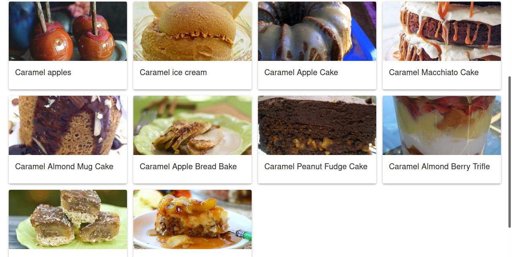
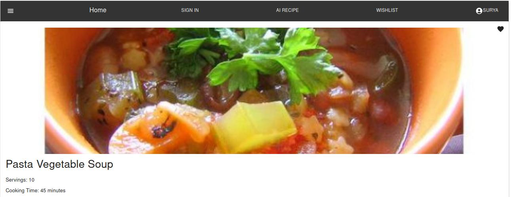
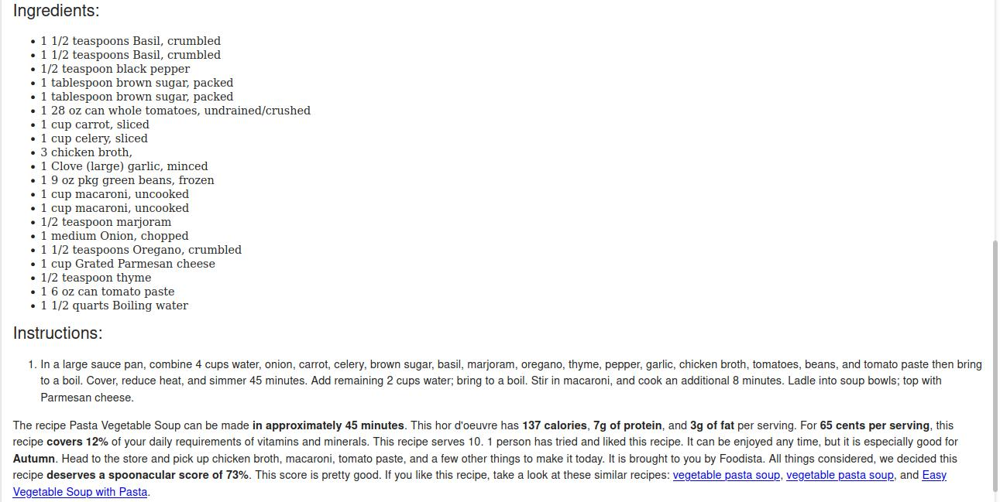
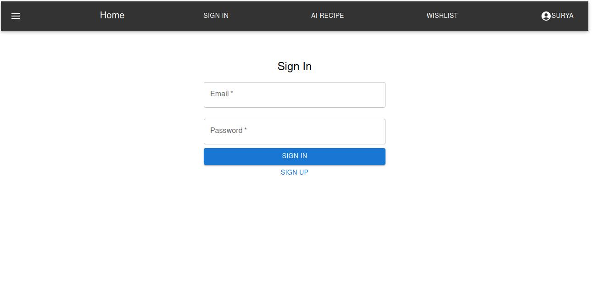
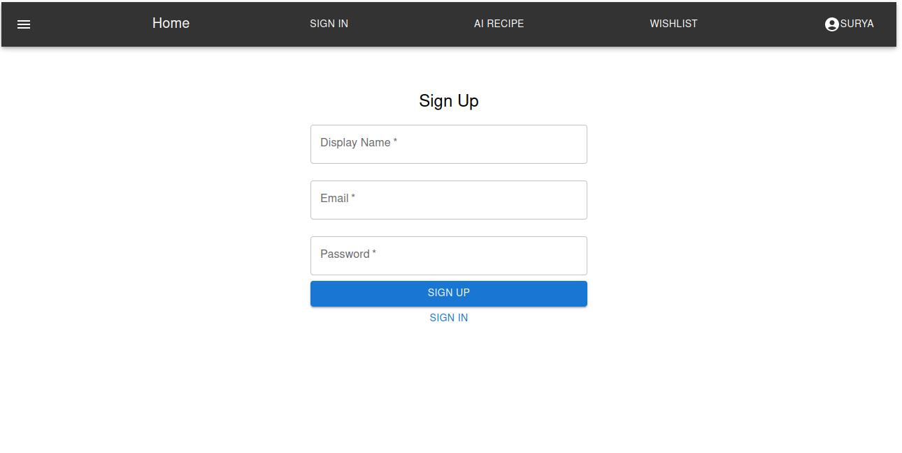
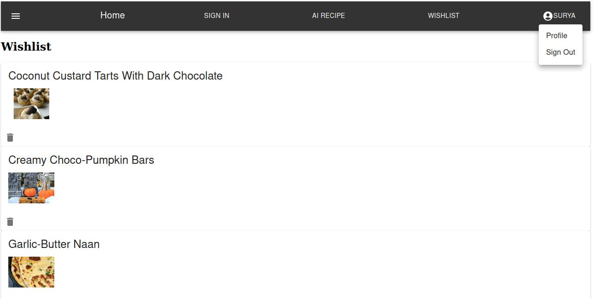

    HomePage Component

    The "HomePage" component is a part of a React application designed for searching and displaying recipes. It provides a user-friendly interface for entering search queries and viewing search results.

    Recipe Search: Users can enter keywords for recipe searches.
    Display Recipes: Search results are displayed with images and titles.
    Clickable Recipes: Users can click on a recipe to view its details.

    ! alt text(public/images/homepage1.jpg?raw=true)
    

    RecipeDetails Component
    The "RecipeDetails" component is a React-based recipe information display page designed for viewing the details of a specific recipe.

    Recipe Details: Display comprehensive information about a recipe, including its title, image, servings, and cooking time.
    Ingredients: List the ingredients needed for the recipe, along with small images of each ingredient when available.
    Instructions: Present step-by-step cooking instructions and a summary of the recipe.
    Wishlist Functionality: Allow users to add or remove recipes from their wishlist using a heart-shaped button. The button's color changes to red when the recipe is added to the wishlist.

    
    

    Sign-In and Sign-Up Component

    
    

    Wishlist Component

    View the Recipe and later on we can delete the recipe. From there if we click the image of the recipe it will take you to the recipe details page.

    

    Note:

    It order to add the firebase database to your project. Please create your firebase setup and the necessary details in the firebaseConfig.js file 

    apiKey: "your-key",
    authDomain: "",
    databaseURL: "",
    projectId: "",
    storageBucket: "",
    messagingSenderId: "",
    appId: ""

    Happy Coding folks!

